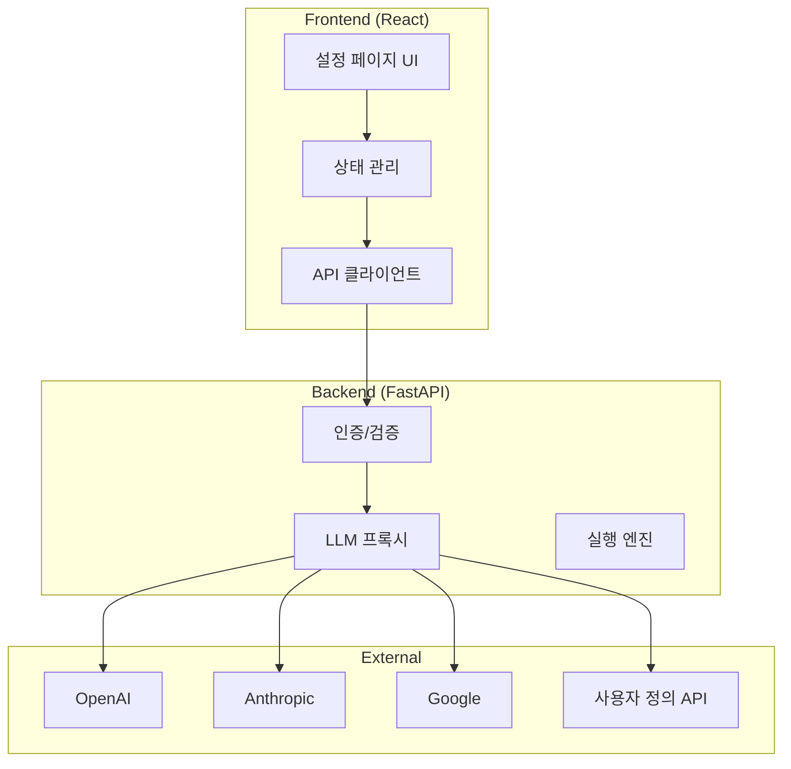
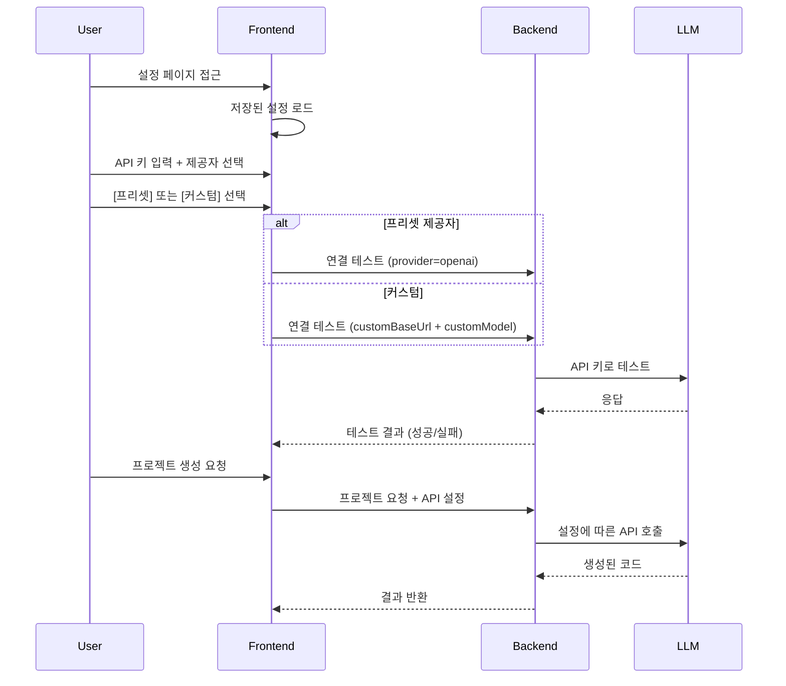

# 사용자 직접 AI API 연결 기능 설계

## 1. 개요

사용자가 웹 UI에서 직접 AI API 키를 입력하고 관리할 수 있는 기능을 설계합니다. Roo Code처럼 다양한 제공자와 커스텀 엔드포인트를 지원합니다.

### 현재 문제점
- React가 설치되어 있지 않음 (npm install 미실행)
- AI API가 환경 변수에만 의존하여 사용자가 연결하기 어려움

### 해결책
- 프론트엔드에서 API 키 입력 UI 제공
- 백엔드에서 동적으로 API 키를 받아 LLM 호출
- 커스텀 API 엔드포인트 지원 (Roo Code 스타일)

---

## 2. 아키텍처



---

## 3. 프론트엔드 설계

### 3.1 설정 페이지 컴포넌트

**파일:** `frontend/src/pages/Settings.tsx` (신규)

```typescript
interface ApiConfig {
  // 제공자 유형
  providerType: 'preset' | 'custom';
  
  // 프리셋 제공자 선택 (preset 선택 시)
  provider?: 'openai' | 'anthropic' | 'google' | 'azure' | 'deepseek' | 'cohere' | 'mistral' | 'xai';
  
  // 커스텀 설정 (custom 선택 시)
  customName?: string;
  customBaseUrl?: string;
  customModel?: string;
  
  // 공통
  apiKey: string;
  temperature?: number;
  maxTokens?: number;
}

interface SettingsPageProps {
  onSave: (config: ApiConfig) => void;
  onTest: (config: ApiConfig) => Promise<boolean>;
}
```

### 3.2 지원 제공자 목록

| 제공자 | 기본 Base URL | 기본 모델 |
|--------|---------------|-----------|
| OpenAI | https://api.openai.com/v1 | gpt-4 |
| Anthropic | https://api.anthropic.com | claude-3-opus |
| Google | https://generativelanguage.googleapis.com/v1 | gemini-pro |
| Azure OpenAI | (사용자 입력) | gpt-4 |
| DeepSeek | https://api.deepseek.com | deepseek-chat |
| Cohere | https://api.cohere.ai | command-r-plus |
| Mistral | https://api.mistral.ai | mistral-large |
| XAI (Grok) | https://api.x.ai | grok-2-1212 |
| **Custom** | (사용자 입력) | (사용자 입력) |

### 3.3 기능 목록

| 기능 | 설명 |
|------|------|
| 제공자 유형 선택 | 프리셋 vs 커스텀 선택 |
| 프리셋 제공자 | 8개 제공자 중 선택 |
| 커스텀 API | 직접 URL과 모델 입력 |
| API 키 입력 | 보안 입력 필드 (마스킹 처리) |
| 모델 선택 | 제공자에 따른 모델 선택 또는 직접 입력 |
| 연결 테스트 | 입력한 API 키로 테스트 요청 |
| 설정 저장 | 로컬 스토리지에 저장 |
| 설정 불러오기 | 저장된 설정 로드 |

### 3.4 UI 구조

```
┌─────────────────────────────────────────┐
│         AI API 설정                      │
├─────────────────────────────────────────┤
│  제공자 유형:  [프리셋] [커스텀]          │
│                                         │
│  (프리셋 선택 시)                        │
│  제공자:     [OpenAI ▼]                  │
│  모델:       [gpt-4 ▼]                   │
│                                         │
│  (커스텀 선택 시)                        │
│  이름:       [My API]                    │
│  Base URL:   [https://api.example.com/v1]│
│  모델:       [model-name]                │
│                                         │
│  API Key:   [••••••••••••••••]          │
│                                         │
│  [연결 테스트]  [저장]                    │
└─────────────────────────────────────────┘
```

---

## 4. 백엔드 설계

### 4.1 API 엔드포인트

**파일:** `api/server.py` (수정)

```python
class ApiConfigRequest(BaseModel):
    """API 설정 요청"""
    provider_type: str  # 'preset' or 'custom'
    provider: Optional[str] = None  # preset 선택 시
    custom_name: Optional[str] = None
    custom_base_url: Optional[str] = None
    custom_model: Optional[str] = None
    api_key: str
    temperature: float = 0.7
    max_tokens: int = 4000

@app.post("/api/config")
async def save_config(config: ApiConfigRequest):
    """API 설정 저장 (세션에 임시 저장)"""
    pass

@app.post("/api/config/test")
async def test_connection(config: ApiConfigRequest):
    """API 연결 테스트"""
    pass

@app.post("/api/project/execute")
async def execute_project(
    request: ProjectRequest,
    background_tasks: BackgroundTasks
):
    """프로젝트 실행 (동적 API 키 사용)"""
    pass
```

### 4.2 LLM 클라이언트 추상화

**파일:** `core/llm_client.py` (신규)

```python
from abc import ABC, abstractmethod
from typing import Optional, Dict, Any
import httpx

class LLMClient(ABC):
    """LLM 클라이언트 추상 클래스"""
    
    @abstractmethod
    async def generate(
        self, 
        prompt: str, 
        api_key: str,
        model: str,
        base_url: Optional[str] = None,
        **kwargs
    ) -> str:
        pass

class OpenAIClient(LLMClient):
    """OpenAI 클라이언트"""
    BASE_URL = "https://api.openai.com/v1"
    
    async def generate(self, prompt, api_key, model, base_url=None, **kwargs):
        # OpenAI API 호출 로직

class AnthropicClient(LLMClient):
    """Anthropic 클라이언트"""
    BASE_URL = "https://api.anthropic.com"
    
    async def generate(self, prompt, api_key, model, base_url=None, **kwargs):
        # Anthropic API 호출 로직

class CustomClient(LLMClient):
    """커스텀 API 클라이언트"""
    
    async def generate(self, prompt, api_key, model, base_url, **kwargs):
        # 사용자 정의 URL로 API 호출
        async with httpx.AsyncClient() as client:
            response = await client.post(
                f"{base_url}/chat/completions",
                headers={
                    "Authorization": f"Bearer {api_key}",
                    "Content-Type": "application/json"
                },
                json={
                    "model": model,
                    "messages": [{"role": "user", "content": prompt}]
                }
            )
            return response.json()

class LLMClientFactory:
    """LLM 클라이언트 팩토리"""
    
    @staticmethod
    def get_client(provider: str) -> LLMClient:
        clients = {
            "openai": OpenAIClient(),
            "anthropic": AnthropicClient(),
            "custom": CustomClient(),
            # ... 기타 제공자
        }
        return clients.get(provider, CustomClient())
```

### 4.3 동적 API 키 처리

- 요청 시 프론트엔드에서 API 키를 헤더 또는 본문과 함께 전송
- 각 요청마다 다른 API 키 사용 가능
- 서버에 API 키 저장 안 함 (보안)

---

## 5. 데이터 흐름



---

## 6. 구현 단계

### 1단계: 프론트엔드 설정 UI
- [ ] 설정 페이지 컴포넌트 생성
- [ ] 제공자 유형 선택 (프리셋/커스텀)
- [ ] 프리셋 제공자 드롭다운 (8개 제공자)
- [ ] 커스텀 입력 폼 (이름, URL, 모델)
- [ ] API 키 입력 필드 (보안)
- [ ] 연결 테스트 기능
- [ ] 로컬 스토리지 연동

### 2단계: 백엔드 API
- [ ] `/api/config` 엔드포인트
- [ ] `/api/config/test` 엔드포인트
- [ ] LLM 클라이언트 추상화
- [ ] 다중 제공자 지원 (프리셋)
- [ ] 커스텀 API 지원

### 3단계: 통합
- [ ] 프론트엔드-백엔드 연동
- [ ] 에러 처리
- [ ] 사용자 피드백

---

## 7. 보안 고려사항

1. **API 키 저장 안 함**: 서버에 영구 저장하지 않음
2. **HTTPS 필수**: 프로덕션에서 암호화
3. **입력 검증**: API 키 형식 검증
4. **마스킹**: 화면에 API 키 표시 시 마스킹
5. **세션 타임아웃**: 설정 유효 시간 관리

---

## 8. 사용자 경험

1. **첫 방문 시**: 설정 페이지로 리다이렉트
2. **설정 완료 후**: 메인 페이지 접근 가능
3. **연결 실패 시**: 명확한 에러 메시지
4. **설정 변경 시**: 실시간 테스트 가능
5. **커스텀 지원**: 자체 API 서버 연결 가능
